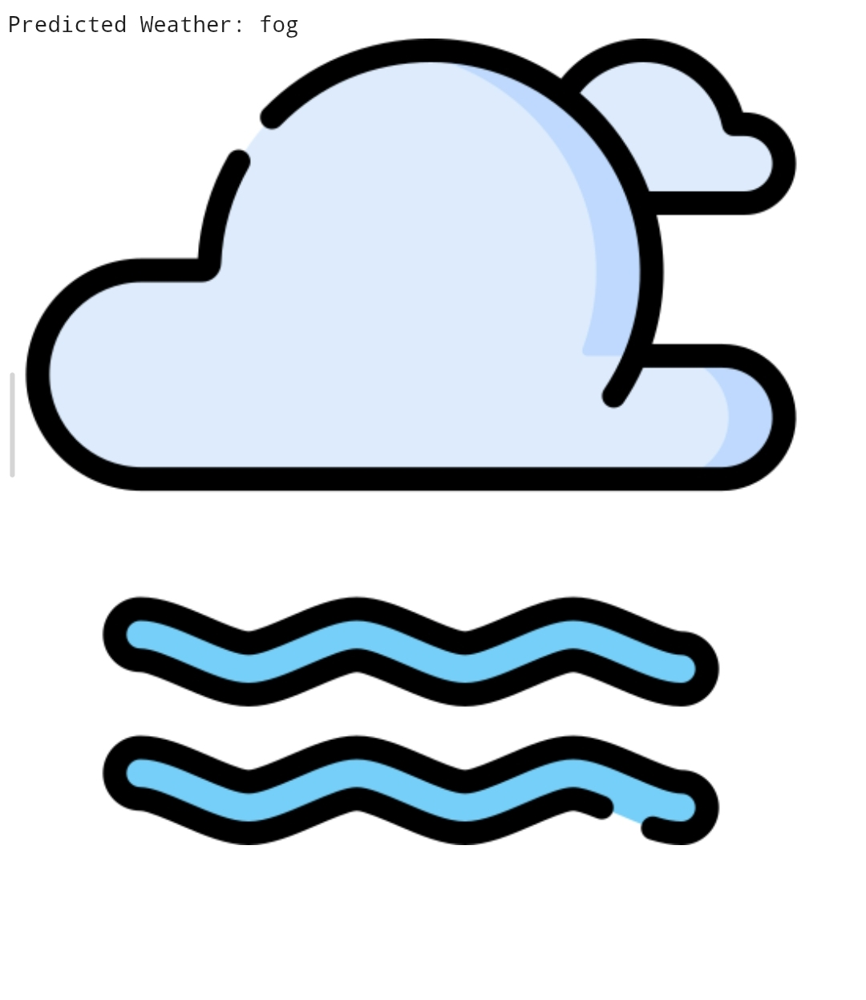

# 🌦️ AI-Powered Weather Forecasting using Machine Learning

## 📌 Project Overview

This project uses Machine Learning techniques to predict weather conditions based on historical weather data. The model analyzes important weather parameters such as precipitation, maximum temperature, minimum temperature, and wind speed to forecast the most likely weather condition.

The project demonstrates the complete Machine Learning workflow including data preprocessing, exploratory data analysis (EDA), visualization, model training, evaluation, and weather prediction.

---

## 🚀 Features

✅ Weather Prediction using Machine Learning

✅ Data Preprocessing and Data Cleaning

✅ Exploratory Data Analysis (EDA)

✅ Correlation Heatmap Visualization

✅ Feature Importance Analysis

✅ Weather Distribution Analysis

✅ Confusion Matrix Visualization

✅ User Input Based Weather Prediction

✅ Random Forest Classification Model

---

## 🛠️ Technologies Used

- Python
- NumPy
- Pandas
- Matplotlib
- Seaborn
- Scikit-Learn
- Google Colab

---

## 📂 Dataset Information

The project uses the Seattle Weather Dataset containing historical weather records.

### Dataset Features

| Feature | Description |
|----------|------------|
| precipitation | Amount of rainfall |
| temp_max | Maximum temperature |
| temp_min | Minimum temperature |
| wind | Wind speed |
| weather | Weather condition |

### Dataset Size

- Total Records: 1461
- Total Features: 6

---

## 🔍 Exploratory Data Analysis (EDA)

The dataset was analyzed to understand:

- Data structure
- Statistical summary
- Missing values
- Feature relationships
- Weather distribution

### Data Quality Check

✔ No missing values found

✔ Dataset is clean and ready for Machine Learning

---

## 🛠️ Data Preprocessing

The following preprocessing steps were performed:

- Label Encoding for categorical weather labels
- Feature Selection
- Train-Test Split

Selected Features:

```python
["precipitation", "temp_max", "temp_min", "wind"]
```

---

## 🤖 Machine Learning Model

### Random Forest Classifier

The Random Forest Classifier was used to train the weather prediction model.

### Why Random Forest?

- High Accuracy
- Handles Non-Linear Data
- Robust Against Overfitting
- Good Feature Importance Analysis

---

## 📈 Model Performance

### Accuracy Score

```text
Accuracy: 80.05%
```

The model achieved approximately 80% accuracy in predicting weather conditions.

---

## 📋 Classification Report

Performance metrics evaluated:

- Precision
- Recall
- F1-Score
- Support

The classification report provides detailed insights into model performance across different weather categories.

---

## 🔲 Confusion Matrix

A confusion matrix was generated to visualize the model's prediction performance and identify classification errors.

---

## 📊 Data Visualizations

### 🔥 Correlation Heatmap

Shows relationships between weather features and helps identify correlations among variables.

### 📈 Feature Importance Analysis

Displays the contribution of each feature toward weather prediction.

### 🌦️ Weather Distribution

Shows the frequency of different weather conditions present in the dataset.

---

## 📸 Project Output

### Sample Input

```text
☀️ SUN
Precipitation: 0
Max Temperature: 25
Min Temperature: 15
Wind Speed: 2

🌧️ RAIN
Precipitation: 10
Max Temperature: 12
Min Temperature: 8
Wind Speed: 4

🌫️ FOG
Precipitation: 0
Max Temperature: 10
Min Temperature: 5
Wind Speed: 1

❄️ SNOW
Precipitation: 5
Max Temperature: 2
Min Temperature: -3
Wind Speed: 2

🌦️ DRIZZLE
Precipitation: 2
Max Temperature: 14
Min Temperature: 10
Wind Speed: 2
```


# 📸 Project Outputs

## ☀️ Sun Prediction


## 🌧️ Rain Prediction


## 🌫️ Fog Prediction


## ❄️ Snow Prediction


## 🌦️ Drizzle Prediction
🌦️ Drizzle: Light rain with very small water droplets.

---
## 📂 Project Structure

```text
AI-Powered-Weather-Forecasting-using-Machine-Learning/
│
├── 📓 Weather_Forecasting.ipynb      # Main Jupyter Notebook
├── 📊 seattle-weather.csv            # Dataset
├── 📄 README.md                      # Project Documentation
├── 📦 requirements.txt               # Required Libraries
│
├── 📁 output_images/
│   ├── 🌡️ heatmap.png
│   ├── 📈 confusion_matrix.png
│   ├── 📊 feature_importance.png
│   ├── ☀️ sun_output.png
│   ├── 🌧️ rain_output.png
│   ├── 🌫️ fog_output.png
│   ├── ❄️ snow_output.png
│   └── 🌦️ drizzle_output.png
│
└── 🤖 Trained Machine Learning Models
```


---

## 🔮 Future Improvements

- Hyperparameter Tuning
- Model Optimization
- Multiple Algorithm Comparison
- Real-Time Weather API Integration
- Streamlit Web Application
- Deep Learning Based Weather Prediction
- Interactive Dashboard Development

---

## 🎯 Key Learning Outcomes

This project demonstrates:

- Data Analysis
- Data Visualization
- Feature Engineering
- Classification Techniques
- Model Evaluation
- Machine Learning Deployment Concepts

---

## 👨‍💻 Author

### Mr. Upendra Kushwaha

Machine Learning | Artificial Intelligence | Data Science Enthusiast

---

## ⭐ Support

If you found this project useful, please consider giving it a ⭐ on GitHub.

Your support helps motivate future AI and Machine Learning projects.# -AI-Powered-Weather-Forecasting-using-Machine-Learning
